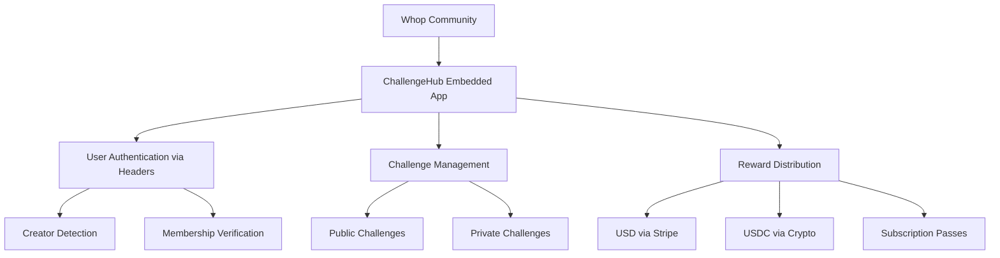

# ChallengeHub - Whop App Integration Guide

ChallengeHub is a sophisticated **Whop app** designed to be embedded into Whop communities, allowing creators to launch user-generated content challenges with multiple reward types.

## 🎯 What is ChallengeHub?

Based on the [Whop Developer Documentation](https://dev.whop.com/introduction), ChallengeHub is built as an **embedded web application** that integrates seamlessly with the Whop ecosystem:

- **Zero Authentication Required**: Whop handles all user authentication when the app is embedded
- **Automatic User Context**: User information is passed via headers from Whop
- **Community Integration**: Leverages Whop's membership and payment systems
- **Creator-Focused**: Designed specifically for Whop creators and their communities

## 🏗️ Architecture Overview

### Whop App Integration Model



### Key Components

1. **Whop SDK Integration** (`lib/whop-sdk.ts`)

   - Handles user context from Whop headers
   - Manages membership verification
   - Creates subscription rewards

2. **Authentication Middleware** (`lib/auth-middleware.ts`)

   - Processes Whop user headers
   - Syncs users with internal database
   - Provides role-based access control

3. **Challenge System** (`app/api/challenges/`)

   - Public and private challenge support
   - Funding verification gates
   - Submission management

4. **Payment Integration** (`lib/stripe.ts`)
   - USD payments via Stripe
   - USDC crypto integration (mock)
   - Whop subscription pass granting

## 🚀 Setting Up as a Whop App

### 1. Whop Developer Setup

1. Visit the [Whop Developer Dashboard](https://dev.whop.com)
2. Create a new app and configure it as an **embedded application**
3. No redirect URIs needed - authentication is handled automatically
4. Get your API key for backend operations

### 2. Environment Configuration

```bash
# Whop App Configuration
WHOP_API_KEY=your_whop_api_key

# Database (Supabase)
NEXT_PUBLIC_SUPABASE_URL=your_supabase_url
NEXT_PUBLIC_SUPABASE_ANON_KEY=your_supabase_anon_key
SUPABASE_SERVICE_ROLE_KEY=your_supabase_service_role_key

# Payments (Stripe)
NEXT_PUBLIC_STRIPE_PUBLISHABLE_KEY=your_stripe_publishable_key
STRIPE_SECRET_KEY=your_stripe_secret_key
STRIPE_WEBHOOK_SECRET=your_stripe_webhook_secret
```

### 3. Database Schema

Run the SQL schema in `supabase/schema.sql` which includes:

- **Users table**: Synced with Whop user data
- **Challenges table**: Public/private challenge management
- **Submissions table**: User content submissions
- **Payments table**: Transaction tracking
- **Row Level Security**: Proper access controls

### 4. Deployment as Whop App

Deploy to Vercel or your preferred platform:

```bash
npm run build
# Deploy to your hosting platform
```

Then configure your app in the Whop dashboard to point to your deployed URL.

## 🔄 How Authentication Works

### Whop App Authentication Flow

When ChallengeHub is embedded in a Whop community:

1. **User visits Whop community** → Whop handles authentication
2. **User accesses ChallengeHub** → App receives user context via headers
3. **Headers processed** → `getUserFromHeaders()` extracts user info
4. **Database sync** → User data synced with internal database
5. **Creator status** → Determined via Whop API call
6. **Access granted** → User can interact with appropriate features

### Header-based User Context

```typescript
// Headers provided by Whop when app is embedded:
'x-whop-user-id': 'user_123'
'x-whop-user-email': 'user@example.com'
'x-whop-username': 'johndoe'
'x-whop-avatar-url': 'https://...'
'x-whop-discord-id': 'discord_456'
```

## 🎮 Core Features

### Challenge Creation (Creators Only)

- **Public Challenges**: Visible to all Whop users
- **Private Challenges**: Only visible to specific community members
- **Funding Gates**: Challenges must be pre-funded before going live
- **Multiple Reward Types**: USD, USDC, or subscription passes

### User Participation

- **Browse Challenges**: See public + accessible private challenges
- **Submit Content**: Link-based submissions (TikTok, Twitter, etc.)
- **Track Status**: Real-time submission status updates

### Content Moderation

- **Manual Review**: Creators approve/reject submissions
- **Automatic Payouts**: Payments triggered on approval
- **Reward Distribution**: Handled via appropriate payment method

### Payment Methods

1. **USD Payments**: Via Stripe integration
2. **USDC Crypto**: Mock implementation (extensible)
3. **Subscription Passes**: Via Whop API membership creation

## 📊 Monetization Options

Based on [Whop's payment models](https://dev.whop.com/introduction), ChallengeHub could implement:

### Transaction Fees

Take a percentage of each challenge reward as a transaction fee.

### Installation Fee

Charge a one-time fee for creators to install ChallengeHub.

### Per Seat Pricing

Charge based on community member count.

### Monthly Subscription

Recurring fee for creators to use ChallengeHub.

### Affiliate Commission

Revenue sharing with creators who promote the app.

## 🛠️ Development Guide

### Key Files Structure

```
challengehub/
├── lib/
│   ├── whop-sdk.ts          # Whop API integration
│   ├── auth-middleware.ts   # Authentication handling
│   ├── supabase.ts         # Database client
│   ├── stripe.ts           # Payment processing
│   └── types.ts            # TypeScript definitions
├── app/
│   ├── api/
│   │   ├── challenges/     # Challenge management
│   │   ├── submissions/    # Submission handling
│   │   └── payments/       # Payment processing
│   ├── challenges/         # Challenge pages
│   └── dashboard/          # Creator dashboard
├── components/
│   ├── layout/            # Layout components
│   ├── challenge/         # Challenge components
│   └── ui/                # Base UI components
└── supabase/
    └── schema.sql         # Database schema
```

### API Routes

- `GET /api/challenges` - List challenges
- `POST /api/challenges` - Create challenge (creators only)
- `POST /api/challenges/[id]/submit` - Submit to challenge
- `POST /api/challenges/[id]/moderate` - Moderate submission
- `POST /api/payments/fund` - Fund challenge
- `POST /api/payments/payout` - Process payout

### Component Architecture

- **Whop-aware components**: Automatically detect user context
- **Role-based rendering**: Different UI for creators vs users
- **Responsive design**: Works on desktop and mobile
- **Real-time updates**: Live status updates for submissions

## 🚦 Getting Started

1. **Clone the repository**
2. **Install dependencies**: `npm install`
3. **Set up environment variables**
4. **Create Supabase project and run schema**
5. **Create Whop app in developer dashboard**
6. **Deploy and configure as Whop app**

## 📈 Future Enhancements

- **Advanced Analytics**: Challenge performance metrics
- **Automated Moderation**: AI-powered content review
- **Multi-language Support**: Internationalization
- **Mobile App**: React Native companion app
- **Creator Collaboration**: Multi-creator challenges

## 🤝 Community & Support

- **Documentation**: [Whop Developer Docs](https://dev.whop.com/introduction)
- **Discord**: Join Whop developer community
- **GitHub Issues**: Report bugs and feature requests
- **Support**: Email support for technical assistance

---

**Built for the Whop ecosystem** - ChallengeHub leverages Whop's infrastructure to provide a seamless experience for creators and community members alike.
